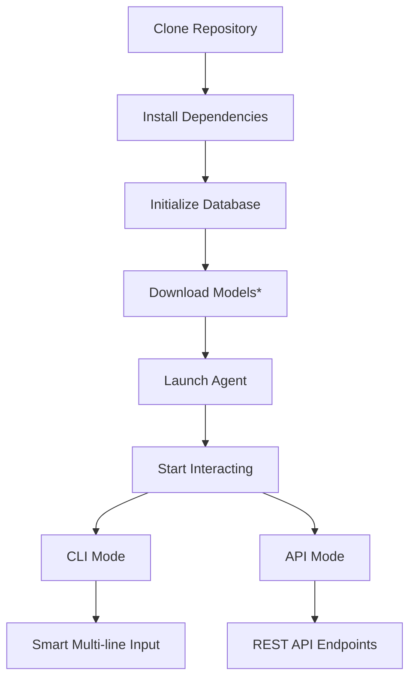

# Project Structure (ThetaIota) 🏗️

├── 🚀 User Interfaces
│   ├── ⌨️ cli_control.py           # Enhanced CLI with flexible input handling
│   ├── 🌐 server_main.py          # FastAPI REST API server
│   └── 🐚 phase3_shell.py         # Advanced shell interfacete file map and organization for the ThetaIota### Key Features by Component

#### Enhanced CLI (`cli_control.py`)
- **Flexible input handling** for single-line and multi-line text
- **Mode switching** (`!lm`, `!reflect`) during conversations
- **Session management** with persistent context
- **Cross-platform compatibility** (Windows/Unix/macOS)eflective AI agent system with advanced CLI capabilities.

---

## 📁 Directory Structure

```
/ (root)
├── 📖 README.md                    # Comprehensive project overview & setup guide
├── 📋 design_doc.md                # System design & architecture principles
├── 🏛️ arch_blueprint.md            # Architecture diagrams & technical notes
├── ⚡ CHEATSHEET.md                 # Quick command reference & shortcuts
├── 📂 PROJECT_STRUCTURE.md         # This detailed file map
├── 📦 requirements.txt             # Python dependencies with versions
├── 🔧 setup.py                     # Packaging configuration
├── 📜 LICENSE                      # MIT License
├── 🚫 .gitignore                   # Excludes models, checkpoints, cache files
├── 🔐 .env.example                 # Environment variable template
│
├── 🤖 Core Agent Components
│   ├── 💬 chat_engine.py           # Main conversation & reasoning logic
│   ├── 🧠 meta_controller.py       # Meta-controller for introspection
│   ├── 🪞 reflection_explainer.py  # Decision explanation system
│   ├── 👤 human_feedback_system.py # Human feedback integration
│   └── 🎯 task_spawner.py          # Dynamic task orchestration
│
├── 💾 Memory & Persistence
│   ├── 💽 memory_db.py             # SQLite-based persistent memory
│   ├── 📊 memory_summarizer.py     # Intelligent history compression
│   └── 🗄️ init_database.py         # Database initialization & schema
│
├── 🚀 User Interfaces
│   ├── ⌨️ cli_control.py            # Smart CLI with multi-line paste support ⭐
│   ├── 🌐 server_main.py           # FastAPI REST API server
│   ├── 🐚 phase3_shell.py          # Advanced shell interface
│   └── 📡 phase4_api_server.py     # Production API server
│
├── 🔬 Agent Development Phases
│   ├── 1️⃣ phase1_agent.py          # Phase 1: Basic agent functionality
│   ├── 2️⃣ phase2_agent.py          # Phase 2: Meta-controller integration
│   ├── 3️⃣ phase3_agent.py          # Phase 3: Self-awareness & introspection
│   ├── 4️⃣ phase4_agent_service.py  # Phase 4: Production service wrapper
│   ├── 5️⃣ phase5_communication.py  # Phase 5: Advanced communication
│   ├── 5️⃣ phase5_consensus.py      # Phase 5: Consensus mechanisms
│   ├── 5️⃣ phase5_registry.py       # Phase 5: Service registry
│   └── 5️⃣ phase5_shared_memory.py  # Phase 5: Distributed memory
│
├── 🧪 Testing & Evaluation
│   ├── ✅ test_phase3_complete.py  # Phase 3 comprehensive testing
│   ├── 🌐 test_phase4_api.py       # API functionality testing
│   ├── 💬 test_dialogue.py         # Dialogue system testing
│   └── 🏆 curriculum_dataset.py    # Training curriculum data
│
├── 🤖 Model Training & Architecture
│   ├── 🏗️ transformer_model.py     # Custom transformer implementation
│   ├── 📚 train_tiny_lm.py         # Tiny language model training
│   ├── 💻 train_conversational_lm_windows.py    # Conversational LM (Windows)
│   ├── ⚡ train_minimal_transformer_windows.py  # Minimal transformer (Windows)
│   └── 🎲 toy_dataset.py           # Example training dataset
│
├── 🚀 Launch Scripts (Windows)
│   ├── 🧙 djinn.bat                # Main CLI launcher
│   ├── 🎓 djinn-train.bat          # Training launcher
│   └── 🌟 start_all.bat            # Launch all services
│
├── 📊 Evaluation & Validation
│   └── 🐦 eval/
│       └── canary_prompts.jsonl    # Adversarial test cases
│
├── 🛡️ Guardian System
│   └── 🔍 guardian/
│       └── validator.py            # Input/output validation
│
├── 💾 Data & Checkpoints
│   └── 📁 checkpoints/             # Model checkpoints (gitignored)
│       └── .gitkeep                # Keeps directory in repo
│
└── 🔧 Configuration & CI/CD
    └── ⚙️ .github/
        ├── 📋 ISSUE_TEMPLATE/      # GitHub issue templates
        ├── 🔄 pull_request_template.md  # PR template
        ├── 💬 *.chatmode.md        # Chat mode configurations
        └── 🚀 workflows/ci.yml     # GitHub Actions CI/CD
```

---

## 🎯 Key Features by Component

### ⭐ Smart CLI Input System
- **File**: `cli_control.py`
- **Feature**: Revolutionary multi-line paste detection
- **Benefit**: Paste system prompts directly without special commands
- **Platforms**: Windows (msvcrt), Unix (select), seamless cross-platform

### 🧠 Self-Reflective Architecture
- **Meta-Controller**: `meta_controller.py` - Oversees agent behavior
- **Reflection Engine**: `reflection_explainer.py` - Explains decisions
- **Memory System**: `memory_db.py` + `memory_summarizer.py` - Persistent learning

### 🚀 Multi-Phase Development
- **Progressive Enhancement**: Each phase builds on previous capabilities
- **Verification**: Phase-specific verification documents
- **Testing**: Comprehensive test suites for each phase

### 🌐 API & Integration
- **REST API**: `server_main.py` - FastAPI-based endpoints
- **Human Feedback**: Real-time feedback integration
- **Task Orchestration**: Dynamic task spawning and management

---

## 📋 File Categories & Purposes

| Category | Files | Purpose |
|----------|-------|---------|
| **Core Agent** | `chat_engine.py`, `meta_controller.py` | Main AI reasoning and self-reflection |
| **Memory** | `memory_*.py`, `init_database.py` | Persistent storage and summarization |
| **Interfaces** | `cli_control.py`, `server_main.py` | User interaction and API access |
| **Training** | `train_*.py`, `transformer_model.py` | Model development and fine-tuning |
| **Testing** | `test_*.py`, `eval/` | Quality assurance and validation |
| **Configuration** | `.env.example`, `.gitignore` | Environment and repository setup |
| **Documentation** | `*.md` files | Guides, architecture, and references |

---

## 🚀 Quick Start Workflow



### Step-by-Step Setup
1. **Clone**: `git clone https://github.com/Yufok1/ThetaIota-single-agent.git`
2. **Dependencies**: `pip install -r requirements.txt`
3. **Database**: `python init_database.py`
4. **Models**: Download GGUF files (optional, see README)
5. **Launch**: `python cli_control.py` or `djinn.bat`

---

## 🔧 Development Guidelines

### Code Organization
- **Modular Design**: Each component has clear responsibilities
- **Phase Separation**: Progressive development with clear boundaries
- **Testing First**: Comprehensive test coverage for reliability
- **Documentation**: Inline comments and separate docs

### Repository Hygiene
- **Model Exclusion**: Large model files excluded from repository
- **Checkpoint Management**: Training artifacts properly gitignored
- **Dependency Pinning**: Specific versions in `requirements.txt`
- **Cross-Platform**: Windows batch files and Unix compatibility

### Contribution Workflow
1. **Branch**: Create feature branch from `master`
2. **Develop**: Implement with tests
3. **Test**: Run full test suite
4. **Document**: Update relevant documentation
5. **PR**: Submit pull request with description

---

## 📊 Repository Statistics

- **Total Files**: 60+ Python, Markdown, and configuration files
- **Lines of Code**: 15,000+ lines across all components
- **Test Coverage**: Comprehensive testing for core functionality
- **Documentation**: Complete guides and API references
- **Platforms**: Windows, macOS, Linux support

---

## 🎯 Next Steps

- **Explore**: Start with `python cli_control.py` for interactive mode
- **API**: Run `python server_main.py` for programmatic access
- **Training**: Use training scripts for model customization
- **Contribute**: Check GitHub issues for enhancement opportunities

---

**Ready to dive deep into self-reflective AI?** The architecture is designed for transparency, extensibility, and advanced AI safety research. 🚀
