# Architecture Blueprint (ThetaIota) 🏗️

**Comprehensive technical architecture and data flow for the ThetaIota self-reflective AI agent system with advanced multi-line input capabilities.**

---

## 🏛️ System Architecture Overview

### Core Design Principles
- **🧠 Self-Reflective**: Agent monitors and improves its own performance
- **💾 Persistent Memory**: SQLite-based long-term memory with summarization
- **🚀 Smart Input**: Revolutionary multi-line paste detection system
- **🔄 Phase-Based**: Progressive development from basic to advanced capabilities
- **🌐 Local-First**: Complete local operation with no external dependencies
- **👥 Human-Centric**: Real-time feedback integration and collaborative improvement

---

## 📊 High-Level Architecture Diagram


---

## 🔄 Data Flow Architecture

### Primary Data Flow

```mermaid
graph LR
    User[👤 User] --> Input[Smart Input System]
    Input --> Processing[Input Processing & Validation]
    Processing --> Agent[🤖 Agent Core]
    Agent --> Memory[(💾 SQLite Memory)]
    Agent --> Introspection[🧠 Introspection Engine]
    Introspection --> Logging[📋 Decision Logging]
    Agent --> Response[💬 Response Generation]
    Response --> User

    Memory --> Summarization[📊 Memory Summarization]
    Summarization --> Agent

    Feedback[👥 Human Feedback] --> Memory
    Memory --> Learning[🔄 Learning Loop]
    Learning --> Agent
```


### Memory Data Flow

```mermaid
graph TD
    Conversations[💬 Conversations] --> Episodic[Episodic Memory<br/>Conversation History]
    Facts[📚 Facts & Knowledge] --> Semantic[Semantic Memory<br/>Learned Patterns]
    Tasks[🎯 Tasks & Actions] --> Procedural[Procedural Memory<br/>Execution Patterns]
    Reflections[🧠 Self-Reflection] --> Meta[Meta Memory<br/>Introspection Data]

    Episodic --> SQLite[(SQLite Database)]
    Semantic --> SQLite
    Procedural --> SQLite
    Meta --> SQLite

    SQLite --> QueryEngine[Query Engine]
    QueryEngine --> Retrieval[Memory Retrieval]
    Retrieval --> Summarizer[Memory Summarizer]
    Summarizer --> Compressed[Compressed Context]
    Compressed --> Agent[🤖 Agent Core]
```


---

## 🧩 Component Architecture

### 1. User Interface Layer

#### Enhanced CLI (`cli_control.py`)
- **Flexible input handling** for single-line and multi-line text
- **Mode switching** (`!lm`, `!reflect`) during conversations
- **Session management** with persistent context
- **Cross-platform compatibility** (Windows/Unix/macOS)

#### REST API (`server_main.py`)
- **FastAPI framework** for high-performance endpoints
- **OpenAPI documentation** with automatic schema generation
- **Bearer token authentication** (optional)
- **CORS support** for web integration
- **Async processing** for concurrent requests

#### Advanced Shell (`phase3_shell.py`)
- **Enhanced CLI features** beyond basic interaction
- **Scripting capabilities** for batch processing
- **Debugging tools** with detailed logging
- **Plugin architecture** for extensibility

#### REST API (`server_main.py`)
- **FastAPI framework** for high-performance endpoints
- **OpenAPI documentation** with automatic schema generation
- **Bearer token authentication** (optional)
- **CORS support** for web integration
- **Async processing** for concurrent requests

#### Advanced Shell (`phase3_shell.py`)
- **Enhanced CLI features** beyond basic interaction
- **Scripting capabilities** for batch processing
- **Debugging tools** with detailed logging
- **Plugin architecture** for extensibility

### 2. Agent Core Layer

#### Chat Engine (`chat_engine.py`)
- **Primary reasoning** and response generation
- **Context management** across conversations
- **Mode coordination** (reflect vs. language model)
- **Performance monitoring** and metrics collection

#### Meta-Controller (`meta_controller.py`)
- **Self-assessment** and performance analysis
- **Decision making** for mode switching and task spawning
- **Learning rate adjustment** based on feedback
- **Resource optimization** and memory management

#### Reflection Engine (`reflection_explainer.py`)
- **Decision explanation** and reasoning transparency
- **Performance analysis** with actionable insights
- **Self-improvement recommendations**
- **Human-interpretable** introspection reports

### 3. Memory System Layer

#### SQLite Database (`memory_db.py`)
- **Optimized schema** for conversation storage
- **Indexed queries** by session, timestamp, and content
- **Migration support** for schema evolution
- **Backup integration** with automatic recovery

#### Memory Summarizer (`memory_summarizer.py`)
- **Extractive summarization** for conversation compression
- **Context preservation** during summarization
- **Query optimization** for fast retrieval
- **Privacy protection** with optional encryption

#### Human Feedback System (`human_feedback_system.py`)
- **Real-time feedback** collection and processing
- **Quality assessment** with rating systems
- **Learning integration** for continuous improvement
- **Bias detection** and fairness monitoring

### 4. Model & Training Layer

#### Transformer Model (`transformer_model.py`)
- **Custom transformer** implementation
- **Multi-head attention** mechanisms
- **Positional encoding** for sequence understanding
- **Optimized training** loops with gradient clipping

#### Training Scripts
- **Conversational LM training** (`train_conversational_lm_windows.py`)
- **Minimal transformer training** (`train_minimal_transformer_windows.py`)
- **Tiny LM training** (`train_tiny_lm.py`)
- **Curriculum learning** support

---

## 🔄 Phase-Based Development Architecture

### Phase 1: Foundation 🏠
```
Basic Agent → Core Functionality
├── Simple chat capabilities
├── Basic memory storage
├── Fundamental API structure
└── Initial testing framework
```

### Phase 2: Intelligence 🧠
```
Meta-Control → Decision Making
├── Meta-controller implementation
├── Decision logging system
├── Performance monitoring
└── Adaptive behavior patterns
```

### Phase 3: Self-Awareness 🪞
```
Introspection → Self-Reflection
├── Introspection capabilities
├── Self-assessment mechanisms
├── Human feedback integration
└── Performance optimization
```

### Phase 4: Production 🚀
```
Service Architecture → Production Ready
├── Service-oriented design
├── API server implementation
├── Error handling & recovery
└── Monitoring & logging
```

### Phase 5: Multi-Agent 🤝
```
Coordination → Advanced Systems
├── Inter-agent communication
├── Consensus mechanisms
├── Shared memory systems
└── Distributed processing
```

---

## 🔒 Security & Safety Architecture

### Local-First Security Model

```mermaid
graph TD
    subgraph "Security Layers"
        InputValidation[Input Validation<br/>Guardian System]
        OutputFiltering[Output Filtering<br/>Safety Checks]
        AccessControl[Access Control<br/>Local Authentication]
        Encryption[Data Encryption<br/>Optional E2E]
    end

    subgraph "Privacy Protection"
        DataMinimization[Data Minimization<br/>Necessary Only]
        LocalStorage[Local Storage<br/>No Cloud Sync]
        AuditLogging[Audit Logging<br/>Transparent Tracking]
    end

    User[👤 User] --> InputValidation
    InputValidation --> OutputFiltering
    OutputFiltering --> AccessControl
    AccessControl --> Encryption

    Encryption --> LocalStorage
    LocalStorage --> DataMinimization
    DataMinimization --> AuditLogging
```


### Safety Mechanisms
- **Guardian System**: Input validation and adversarial detection
- **Output Filtering**: Response quality and safety verification
- **Rate Limiting**: Protection against abuse and DoS attacks
- **Error Handling**: Graceful failure recovery and logging

---

## 📊 Performance & Scalability

### Resource Architecture


### Scalability Features
- **Horizontal Scaling**: Multi-instance deployment support
- **Load Balancing**: Request distribution across instances
- **Caching Layers**: Memory and disk caching for performance
- **Async Processing**: Non-blocking operations for concurrency

---

## 🚀 Deployment Architecture

### Local Deployment
```bash
# Single-command deployment
python cli_control.py

# API server deployment
python server_main.py

# Batch processing
start_all.bat
```

### Production Deployment
```dockerfile
# Containerized deployment
FROM python:3.9-slim
COPY . /app
RUN pip install -r requirements.txt
EXPOSE 8081
CMD ["python", "server_main.py"]
```

### Orchestration
```yaml
# Kubernetes deployment
apiVersion: apps/v1
kind: Deployment
metadata:
  name: thetaiota
spec:
  replicas: 3
  selector:
    matchLabels:
      app: thetaiota
  template:
    spec:
      containers:
      - name: thetaiota
        image: thetaiota:latest
        ports:
        - containerPort: 8081
```

---

## 📈 Monitoring & Observability

### Metrics Architecture

```mermaid
graph TD
    subgraph "Application Metrics"
        ResponseTime[Response Time<br/>Latency Tracking]
        Throughput[Throughput<br/>Requests/Second]
        ErrorRate[Error Rate<br/>Failure Monitoring]
        MemoryUsage[Memory Usage<br/>Resource Tracking]
    end

    subgraph "Business Metrics"
        UserSatisfaction[User Satisfaction<br/>Feedback Scores]
        TaskCompletion[Task Completion<br/>Success Rates]
        LearningProgress[Learning Progress<br/>Improvement Tracking]
        IntrospectionQuality[Introspection Quality<br/>Self-Assessment]
    end

    subgraph "Infrastructure Metrics"
        CPULoad[CPU Load<br/>Processing Utilization]
        DiskIO[Disk I/O<br/>Storage Performance]
        NetworkIO[Network I/O<br/>Data Transfer]
        SystemHealth[System Health<br/>Overall Status]
    end

    Agent[🤖 Agent Core] --> ResponseTime
    Agent --> Throughput
    Agent --> ErrorRate
    Agent --> MemoryUsage

    Agent --> UserSatisfaction
    Agent --> TaskCompletion
    Agent --> LearningProgress
    Agent --> IntrospectionQuality

    Infrastructure[🏗️ Infrastructure] --> CPULoad
    Infrastructure --> DiskIO
    Infrastructure --> NetworkIO
    Infrastructure --> SystemHealth
```


### Logging Architecture
- **Structured Logging**: JSON format with consistent schema
- **Log Levels**: DEBUG, INFO, WARNING, ERROR, CRITICAL
- **Log Aggregation**: Centralized log collection and analysis
- **Audit Trails**: Complete operation tracking for compliance

---

## 🔧 Development & Testing Architecture

### Testing Pyramid


### CI/CD Pipeline

```mermaid
graph LR
    Code[💻 Code] --> Lint[🔍 Linting]
    Lint --> Test[🧪 Testing]
    Test --> Build[🏗️ Build]
    Build --> Security[🔒 Security Scan]
    Security --> Deploy[🚀 Deploy]
    Deploy --> Monitor[📊 Monitor]
```


---

## 🎯 Success Metrics & KPIs

### Technical KPIs
- **Performance**: Response time < 2s, throughput > 100 req/min
- **Reliability**: Uptime > 99.9%, error rate < 0.1%
- **Scalability**: Handle 1000+ concurrent users
- **Efficiency**: Memory usage < 4GB, CPU < 80%

### Quality KPIs
- **Accuracy**: Response quality score > 8.5/10
- **Safety**: Safety violation rate < 0.01%
- **User Satisfaction**: Feedback score > 4.5/5
- **Learning**: Continuous improvement metrics

### Business KPIs
- **Adoption**: Active users and engagement rates
- **Retention**: User retention and churn rates
- **Growth**: Feature usage and expansion metrics
- **Impact**: Measurable improvement in user outcomes

---

## 🚀 Future Architecture Evolution

### Phase 6: Advanced AI Safety 🛡️
- **Value Alignment**: Advanced safety mechanisms
- **Uncertainty Quantification**: Confidence estimation
- **Adversarial Robustness**: Attack detection and mitigation
- **Ethical AI**: Bias detection and fairness

### Phase 7: Multi-Modal Intelligence 🎨
- **Multi-Modal Input**: Text, image, audio processing
- **Cross-Modal Reasoning**: Integrated understanding
- **Generative Capabilities**: Content creation across modalities
- **Interactive Learning**: Human-AI collaborative learning

### Phase 8: Distributed Intelligence 🌐
- **Federated Learning**: Privacy-preserving distributed training
- **Edge Computing**: Local processing with cloud coordination
- **Swarm Intelligence**: Multi-agent coordination
- **Autonomous Systems**: Self-organizing AI networks

---

## 📚 Documentation Architecture

### Documentation Hierarchy
```
📖 README.md              # Project overview & quick start
📋 PROJECT_STRUCTURE.md   # File organization & components
🎯 CHEATSHEET.md          # Commands & shortcuts reference
🏗️ arch_blueprint.md      # Technical architecture (this file)
📚 design_doc.md          # Design principles & philosophy
📝 phase*_verification.md # Phase completion verification
🔧 API Documentation      # Auto-generated from FastAPI
```

### Documentation Standards
- **Markdown Format**: Consistent formatting and structure
- **Version Control**: Documentation updates with code changes
- **Cross-References**: Hyperlinked documentation sections
- **Searchable**: Indexed content for easy navigation

---

## 🎉 Conclusion

The ThetaIota architecture represents a **comprehensive approach** to self-reflective AI development:

### 🏆 Architectural Strengths
- **🧠 Intelligence**: Self-aware, introspective AI capabilities
- **🚀 Innovation**: Revolutionary smart input system
- **🔒 Security**: Local-first architecture with privacy protection
- **📈 Scalability**: Phase-based development for continuous evolution
- **🤝 Collaboration**: Human-AI interaction with feedback loops

### 🎯 Design Philosophy
- **Transparency**: Every decision and learning moment is logged
- **Safety**: Comprehensive validation and safety mechanisms
- **Extensibility**: Modular design for future enhancements
- **User-Centric**: Seamless experience with advanced capabilities

### 🚀 Vision
ThetaIota is not just another AI system—it's a **platform for exploring the frontiers of self-reflective AI**, designed for transparency, safety, and meaningful human-AI collaboration.

**The architecture is ready for the future of AI development.** ✨🤖