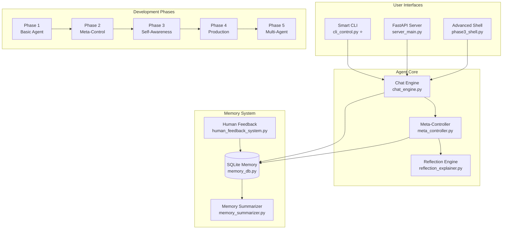
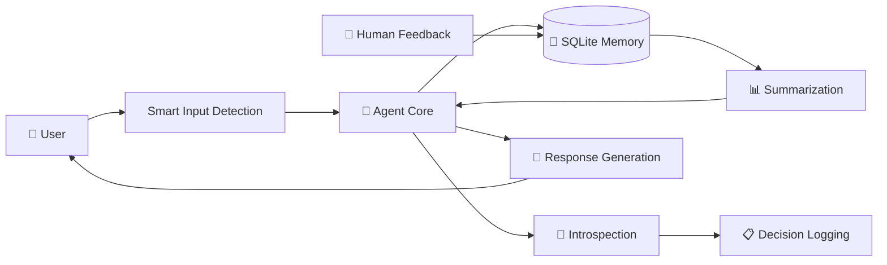

# Design Document (ThetaIota) 🏗️

**Comprehensive architecture, design principles, and operational guidelines for the ThetaIota self-reflective AI agent system.**

---

## 🎯 System Overview

### Core Mission
ThetaIota is a **self-reflective AI agent system** designed for transparent, introspective AI development with advanced human-AI interaction capabilities.

### Key Principles
- **🧠 Self-Awareness**: Agent monitors its own performance, decisions, and learning patterns
- **💾 Persistent Memory**: SQLite-based memory system with intelligent summarization
- **🚀 Smart Input**: Revolutionary multi-line paste detection for seamless interaction
- **🔄 Progressive Development**: Phase-based architecture from basic to advanced capabilities
- **🌐 Local-First**: Complete local operation with no external API dependencies
- **👥 Human Integration**: Real-time feedback loops and collaborative improvement

---

## 🏛️ Architecture Overview

### Core Components Architecture

### Data Flow Architecture

---

## 🚀 Interaction Modalities

### Enhanced CLI Interface
- **Flexible Input Handling**: Support for both single-line and multi-line text input
- **Cross-Platform Compatibility**: Works on Windows, macOS, and Linux systems
- **Mode Switching**: Easy switching between different agent modes during conversation
- **Session Management**: Persistent conversation contexts and history

### REST API Server
- **FastAPI Framework**: High-performance async web framework
- **OpenAPI Documentation**: Automatic API schema generation
- **Authentication**: Optional Bearer token security
- **CORS Support**: Cross-origin request handling for web integration

### Advanced Shell Interface
- **Extended Features**: Additional CLI capabilities beyond basic interaction
- **Scripting Support**: Batch processing and automation features
- **Debugging Tools**: Enhanced logging and inspection capabilities
- **Plugin Architecture**: Extensible system for custom features

### Batch Scripts
- **Windows Launchers**: Convenient batch files for system startup
- **Training Scripts**: Automated model training workflows
- **Multi-Service**: Coordinated launching of all system components

### Introspection Metrics
- **Training Dynamics**: Loss curves, gradient norms, parameter statistics
- **Performance Tracking**: Token confidence, response quality, coherence scores
- **Resource Monitoring**: Memory usage, computation time, disk I/O
- **Decision Analysis**: Reasoning transparency, alternative evaluation

### Trigger Mechanisms
- **Automatic**: Performance plateaus, error patterns, resource limits
- **Manual**: Human feedback, explicit introspection requests
- **Scheduled**: Periodic self-assessment and optimization

### Meta-Learning Capabilities
- **Adaptive Learning Rates**: Dynamic adjustment based on performance
- **Task Spawning**: Generate subtasks for complex queries
- **Memory Management**: Intelligent summarization and pruning
- **Model Switching**: Context-aware mode selection (reflect vs. LM)

---

## 💾 Memory Architecture

### SQLite-Based Persistence
- **Schema Design**: Optimized for conversation storage and retrieval
- **Indexing Strategy**: Fast queries by session, timestamp, and content
- **Migration Support**: Version-controlled schema updates
- **Backup Integration**: Automatic checkpointing and recovery

### Memory Types
- **Episodic**: Conversation history and user interactions
- **Semantic**: Factual knowledge and learned patterns
- **Procedural**: Task execution and decision processes
- **Meta**: Self-reflection and introspection data

### Summarization Engine
- **Compression Algorithms**: Extractive and abstractive summarization
- **Context Preservation**: Maintain conversation coherence
- **Query Optimization**: Fast retrieval of relevant memories
- **Privacy Protection**: Optional content encryption

---

## 🔄 Phase-Based Development

### Phase 1: Foundation (Basic Agent)
**Goal**: Establish core conversational capabilities
- Basic chat functionality
- Simple memory storage
- Fundamental API structure
- Initial testing framework

### Phase 2: Meta-Control (Decision Making)
**Goal**: Add intelligent decision-making
- Meta-controller implementation
- Decision logging system
- Performance monitoring
- Adaptive behavior patterns

### Phase 3: Self-Awareness (Introspection)
**Goal**: Enable self-reflection and improvement
- Introspection capabilities
- Self-assessment mechanisms
- Human feedback integration
- Performance optimization

### Phase 4: Production (Service Architecture)
**Goal**: Production-ready deployment
- Service-oriented architecture
- API server implementation
- Error handling and recovery
- Monitoring and logging

### Phase 5: Multi-Agent (Coordination)
**Goal**: Advanced multi-agent systems
- Inter-agent communication
- Consensus mechanisms
- Shared memory systems
- Distributed processing

---

## 🚀 Interaction Modalities

### Smart CLI Interface
- **Multi-line Support**: Revolutionary paste detection
- **Mode Switching**: `!lm` and `!reflect` commands
- **Session Management**: Persistent conversation contexts
- **Real-time Feedback**: Immediate response to user input

### REST API Server
- **FastAPI Framework**: High-performance async endpoints
- **OpenAPI Documentation**: Automatic API documentation
- **Authentication**: Optional Bearer token security
- **CORS Support**: Cross-origin request handling

### Advanced Shell Interface
- **Enhanced Features**: Beyond basic CLI capabilities
- **Scripting Support**: Batch processing and automation
- **Debugging Tools**: Detailed logging and inspection
- **Extension Points**: Plugin architecture for customization

---

## 🧪 Testing & Validation

### Test Categories
- **Unit Tests**: Individual component validation
- **Integration Tests**: End-to-end functionality
- **Performance Tests**: Load and stress testing
- **Adversarial Tests**: Canary prompts and edge cases

### Evaluation Framework
- **Canary Prompts**: Adversarial test cases in `eval/canary_prompts.jsonl`
- **Quality Metrics**: Response coherence, factual accuracy, helpfulness
- **Safety Checks**: Input validation and output filtering
- **Performance Benchmarks**: Response time, memory usage, scalability

### Continuous Integration
- **GitHub Actions**: Automated testing and deployment
- **Code Quality**: Linting, type checking, and coverage reports
- **Security Scanning**: Dependency and vulnerability analysis
- **Performance Monitoring**: Automated benchmark tracking

---

## 🔒 Security & Privacy

### Local-First Security
- **No External Dependencies**: All processing on local hardware
- **Data Sovereignty**: Complete control over data and models
- **Network Isolation**: No internet connectivity required
- **Model Security**: Local model storage and execution

### Privacy Protection
- **Conversation Encryption**: Optional end-to-end encryption
- **Data Minimization**: Only necessary data retention
- **Access Control**: Local authentication and authorization
- **Audit Logging**: Transparent operation tracking

### Safety Mechanisms
- **Input Validation**: Guardian system for malicious inputs
- **Output Filtering**: Response quality and safety checks
- **Rate Limiting**: Protection against abuse
- **Error Handling**: Graceful failure and recovery

---

## 📊 Performance & Scalability

### Resource Requirements
- **Memory**: 4GB+ RAM for model loading and processing
- **Storage**: 2GB+ for models, checkpoints, and conversation history
- **CPU**: Multi-core processor for parallel processing
- **GPU**: Optional CUDA support for accelerated inference

### Optimization Strategies
- **Memory Management**: Intelligent caching and garbage collection
- **Query Optimization**: Indexed database queries and result caching
- **Model Quantization**: Reduced precision for faster inference
- **Batch Processing**: Efficient handling of multiple requests

### Monitoring & Observability
- **Performance Metrics**: Response times, throughput, error rates
- **Resource Usage**: CPU, memory, disk, and network monitoring
- **Health Checks**: Automated system health verification
- **Logging**: Structured logging with configurable levels

---

## 🔧 Development Workflow

### Code Organization
- **Modular Architecture**: Clear separation of concerns
- **Type Hints**: Comprehensive Python type annotations
- **Documentation**: Inline comments and docstrings
- **Testing**: Test-driven development approach

### Version Control
- **Git Flow**: Feature branches and pull request workflow
- **Semantic Versioning**: Meaningful version numbers
- **Changelog**: Automated changelog generation
- **Release Management**: Tagged releases with release notes

### Quality Assurance
- **Code Reviews**: Peer review for all changes
- **Automated Testing**: CI/CD pipeline with comprehensive tests
- **Security Audits**: Regular security and dependency scanning
- **Performance Testing**: Load testing and optimization

---

## 🚀 Deployment & Operations

### Local Deployment
- **Single Command**: `python cli_control.py` for immediate use
- **Service Mode**: `python server_main.py` for API access
- **Batch Scripts**: Windows `.bat` files for convenience
- **Configuration**: Environment variables and config files

### Production Deployment
- **Container Support**: Docker containerization
- **Orchestration**: Kubernetes deployment manifests
- **Load Balancing**: Multi-instance scaling
- **Monitoring**: Prometheus metrics and Grafana dashboards

### Backup & Recovery
- **Database Backups**: Automated SQLite database backups
- **Model Checkpoints**: Versioned model checkpoint storage
- **Configuration Backup**: Environment and configuration preservation
- **Disaster Recovery**: Comprehensive recovery procedures

---

## 🎯 Success Criteria

### Phase 0: Design & Planning ✅
- Comprehensive design document completed
- Architecture and resource requirements documented
- Development roadmap and milestones established
- Technical specifications and constraints defined

### Phase 1: Core Functionality 🎯
- Basic conversational AI capabilities
- Persistent memory system implementation
- CLI and API interfaces functional
- Initial testing framework established

### Phase 2: Intelligence & Learning 📈
- Meta-controller and decision-making systems
- Self-reflection and introspection capabilities
- Human feedback integration mechanisms
- Performance optimization and adaptation

### Phase 3: Self-Awareness & Safety 🛡️
- Advanced introspection and self-assessment
- Safety mechanisms and input validation
- Comprehensive testing and evaluation
- Production-ready stability and reliability

### Phase 4: Production & Scale 🚀
- Service-oriented architecture implementation
- Multi-user support and scalability
- Enterprise-grade monitoring and logging
- Comprehensive documentation and support

### Phase 5: Advanced Multi-Agent 🤝
- Inter-agent communication and coordination
- Consensus mechanisms and conflict resolution
- Distributed memory and shared knowledge
- Advanced AI safety and alignment features

---

## 📈 Future Roadmap

### Short Term (3-6 months)
- Complete Phase 3 self-awareness implementation
- Enhanced safety mechanisms and validation
- Improved user experience and interface design
- Performance optimization and resource efficiency

### Medium Term (6-12 months)
- Phase 4 production deployment capabilities
- Multi-modal input/output support
- Advanced learning and adaptation algorithms
- Integration with external tools and services

### Long Term (1-2 years)
- Phase 5 multi-agent coordination systems
- Advanced AI safety and alignment research
- Scalable distributed architecture
- Open-source community and ecosystem development

---

## 🤝 Contributing & Collaboration

### Development Guidelines
- **Code Standards**: PEP 8 compliance and type hints
- **Testing Requirements**: 80%+ test coverage for new features
- **Documentation**: Comprehensive docstrings and user guides
- **Security**: Security review for all changes

### Community Engagement
- **Open Development**: Transparent development process
- **Issue Tracking**: GitHub issues for feature requests and bugs
- **Discussion Forums**: Community discussions and feedback
- **Documentation**: Comprehensive guides and tutorials

---

## 📚 Documentation Ecosystem

| Document | Purpose | Audience |
|----------|---------|----------|
| [`README.md`](../README.md) | Project overview and quick start | All users |
| [`PROJECT_STRUCTURE.md`](../PROJECT_STRUCTURE.md) | File organization and architecture | Developers |
| [`CHEATSHEET.md`](../CHEATSHEET.md) | Command reference and shortcuts | Users & developers |
| [`arch_blueprint.md`](../arch_blueprint.md) | Technical architecture diagrams | Technical team |
| [`phase*_verification.md`](../phase0_verification.md) | Phase completion verification | Project team |

---

## 🎉 Conclusion

ThetaIota represents a **bold step forward** in self-reflective AI development, combining:

- **🧠 Advanced Intelligence**: Self-aware, introspective AI capabilities
- **🚀 Seamless UX**: Revolutionary smart input system
- **🔒 Security First**: Local-first architecture with privacy protection
- **📈 Scalable Design**: Phase-based development for continuous improvement
- **🤝 Human-Centered**: Real-time feedback and collaborative improvement

The system is designed not just for functionality, but for **transparency, safety, and meaningful human-AI interaction**. Every decision, every learning moment, every interaction is logged, analyzed, and used to improve the system's capabilities.

**Welcome to the future of self-reflective AI.** 🚀✨